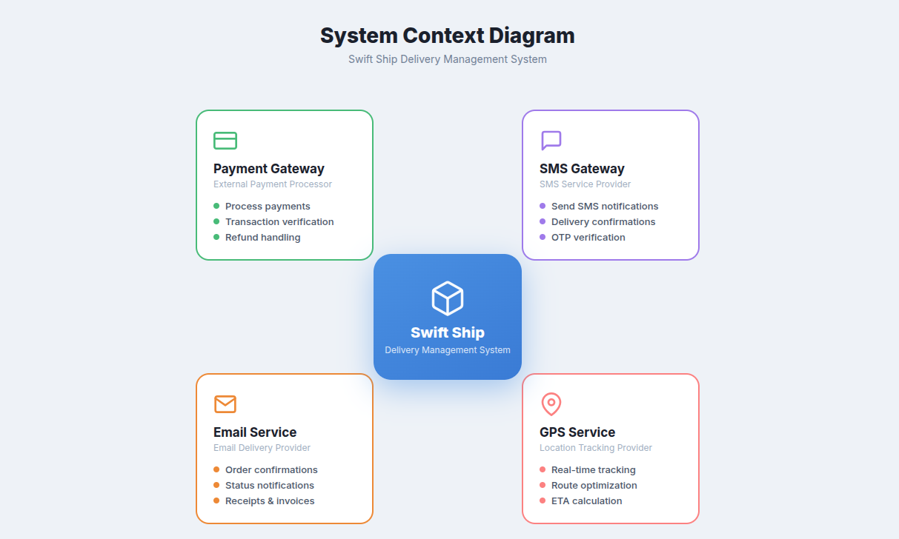
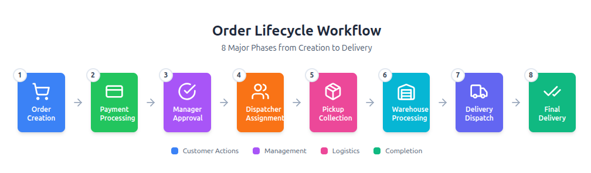
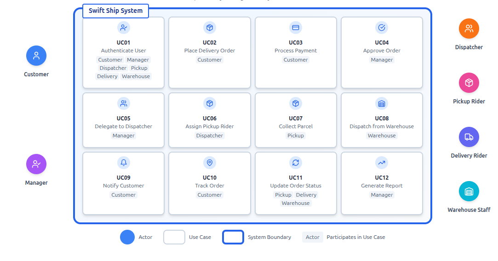
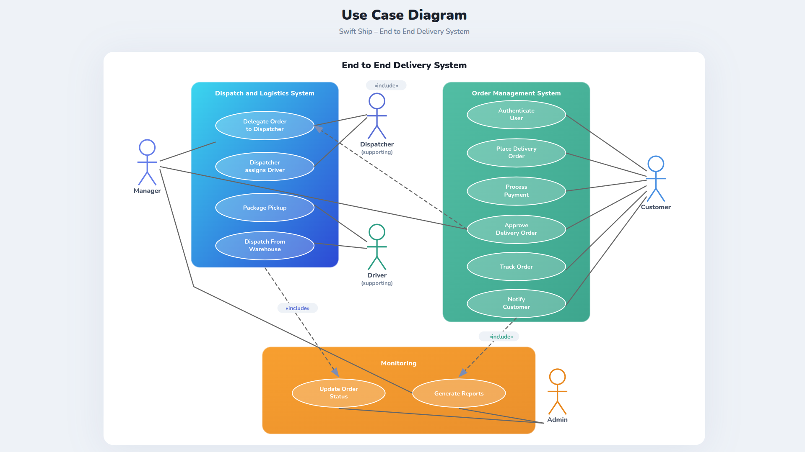
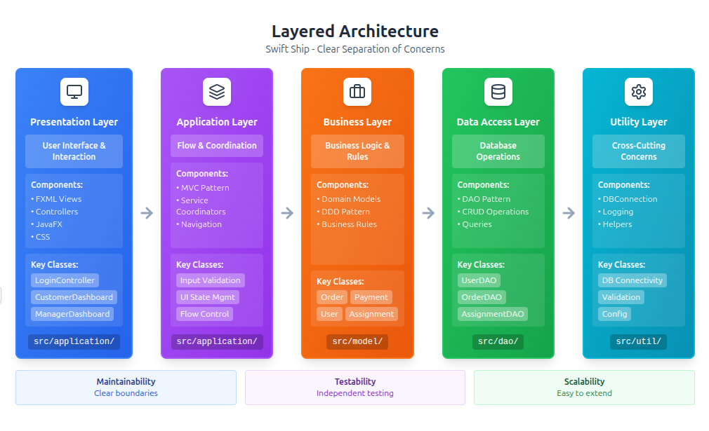
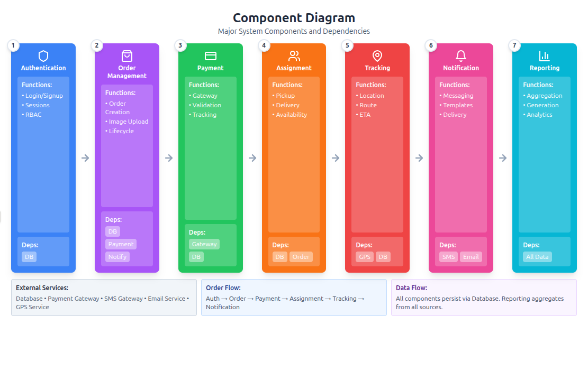
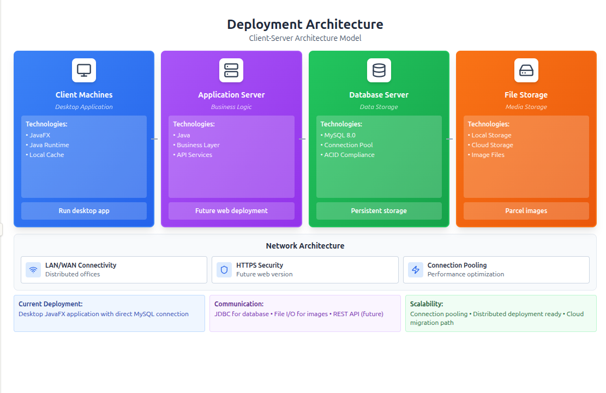

# 📦 Swift Ship: End-to-End Delivery Management System

> **A comprehensive desktop application designed to revolutionize courier logistics through centralized automation, real-time tracking, and role-based workflows.**

---

## 🚀 Project Overview

**Swift Ship** is a JavaFX-based solution developed by **Innovora** to modernize logistics for small-to-medium-sized courier companies. It addresses critical industry pain points such as manual data entry errors, fragmented rider communication, and lack of transparency in parcel tracking .

By digitizing the entire delivery lifecycle, Swift Ship provides a seamless experience for customers while offering powerful management tools for administrators, dispatchers, and warehouse staff .

### 🌟 Key Features
* **7 Distinct User Roles:** Specialized dashboards for Customers, Managers, Dispatchers, Pickup/Delivery Riders, Warehouse Staff, and Admins.
* **Real-Time Workflow:** Automated transition of orders from *Creation* → *Approval* → *Pickup* → *Warehouse* → *Delivery* .
* **Smart Validation:** Managers review shipment photos and payment status before approving orders to prevent fraud.
* **Visual Analytics:** Comprehensive reporting on revenue, rider performance, and delivery success rates .
* **SOLID Architecture:** Built using Layered Architecture and MVC patterns to ensure scalability and maintainability.

---

## 🔄 System Architecture & Design

### 1. High-Level Ecosystem
Swift Ship operates within a broader ecosystem, integrating with Payment Gateways for transactions, SMS/Email services for notifications, and GPS services for real-time location tracking .

### 2. The Order Lifecycle
The core of our business logic is the **8-Phase Order Lifecycle**. Strict state transitions ensure a parcel cannot be delivered before it is picked up or processed .

---

## 🧩 Functional Modules

### Use Case Overview
The system is divided into clear functional modules catering to our 7 user actors.

### Interaction Model
A detailed look at how different actors (Customer, Manager, Dispatcher) interact with the core system boundaries.

---

## 🏗️ Technical Architecture

We utilized a **Layered Architecture** to separate concerns, ensuring that the UI (JavaFX) is decoupled from the Business Logic and Data Access layers .

### 1. Layered Architecture
* **Presentation Layer:** JavaFX FXML views and Controllers .
* **Application Layer:** Handles flow control and UI state .
* **Business Layer:** Domain models (Order, User, Parcel) and business rules .
* **Data Access Layer:** DAO pattern implementation for database persistence .

### 2. Component Design
Major system components include Authentication, Order Management, Payment Processing, Assignment Coordination, and Reporting .

### 3. Deployment Strategy
The application is deployed using a Client-Server model. Client machines run the JavaFX desktop app, communicating with a central MySQL Database Server and File Storage for parcel images .

---

## 🛠️ Technology Stack

| Category | Technology Used | Description |
| :--- | :--- | :--- |
| **Frontend** | JavaFX, FXML, CSS | Rich desktop UI with declarative design  |
| **Backend** | Java 8+ | Core business logic and service layer  |
| **Database** | MySQL 8.0 | Relational data storage with ACID compliance  |
| **Persistence** | JDBC & DAO Pattern | Efficient data access and separation of concerns  |
| **Design** | MVC & DDD | Model-View-Controller and Domain-Driven Design  |

---

## 👨‍💻 The Team (Innovora)

Developed for the **Software Design and Architecture** course at **FAST-NUCES**.

* **Talha Shafi** (23i-0563) - *Team Lead & Full Stack Developer* 
* **Hannan Abid** (23i-0713) - *Frontend & UI/UX Specialist* 
* **Abdul Mahid** (23i-0828) - *Backend & Database Engineer* 

---

*© 2025 Innovora. All Rights Reserved.*
